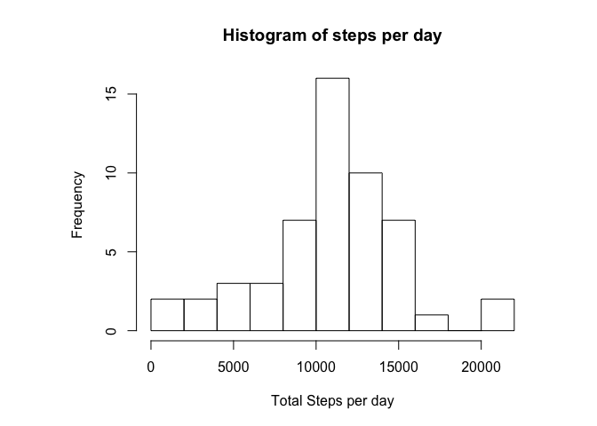
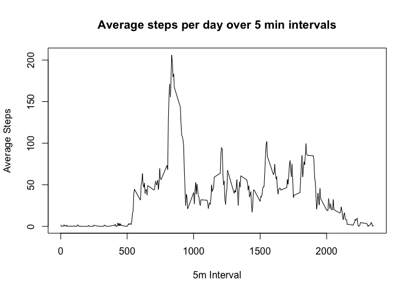
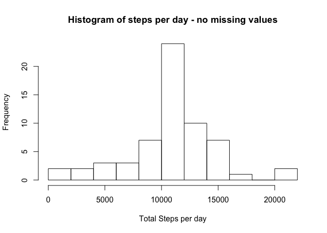
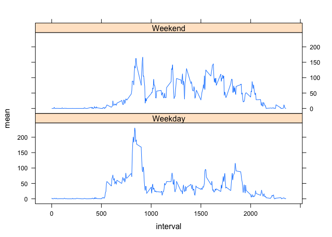

# Reproducible Research: Peer Assessment 1

This assignment looks at movement data from a personal activity device. The data was downloaded from https://d396qusza40orc.cloudfront.net/repdata%2Fdata%2Factivity.zip on the 6th March 2016.


## Loading and preprocessing the data

Read in the uncompressed activity data stored as a csv.


```r
data <- read.csv("activity.csv")
data$date <- as.Date(data$date)
```

## What is mean total number of steps taken per day?


```r
TotalNumStepsPerDay <- aggregate(steps ~ date, data = data, sum)
par(mar = c(5, 8, 4, 4))
hist(TotalNumStepsPerDay$steps, breaks = 10,main = "Histogram of steps per day",xlab = "Total Steps per day")
```



```r
mean(TotalNumStepsPerDay$steps)
```

```
## [1] 10766.19
```

```r
median(TotalNumStepsPerDay$steps) 
```

```
## [1] 10765
```

## What is the average daily activity pattern?


```r
average5minIntervalsPerDay <- aggregate(steps ~ interval, data = data, mean)
plot(average5minIntervalsPerDay$interval,average5minIntervalsPerDay$steps, type = "l"
     , main = "Average steps per day over 5 min intervals"
     ,xlab = "5m Interval"
     ,ylab = "Average Steps")
```



###Calculate the 5-min interval that contains on average the most steps


```r
average5minIntervalsPerDay$interval[max(average5minIntervalsPerDay$steps)==average5minIntervalsPerDay$steps]
```

```
## [1] 835
```

## Imputing missing values

###Total number is rows that are missing steps

```r
sum(is.na(data$steps))
```

```
## [1] 2304
```


###Calculate the mean of each interval to replace missing values and replace NA with that value

The strategy to impute the missing values is to calculate the average for each interval across the entire data and then replace the NA values with this value.


```r
AverageStepsPerInterval <- aggregate(steps ~ interval, data = data, mean)
colnames(AverageStepsPerInterval)[2] <- "AverageSteps"
dataNoMissingValues <- merge(data,AverageStepsPerInterval,by.x = "interval", by.y = "interval")
dataNoMissingValues$AverageSteps[is.na(dataNoMissingValues$steps)] -> dataNoMissingValues$steps[is.na(dataNoMissingValues$steps)] 
dataNoMissingValues <- dataNoMissingValues[,c("interval","steps","date")]
```

##What is mean total number of steps taken per day with missing values replaced? 


```r
TotalNumStepsPerDayNoNA <- aggregate(steps ~ date, data = dataNoMissingValues, sum)
hist(TotalNumStepsPerDayNoNA$steps, breaks = 10,main = "Histogram of steps per day - no missing values",xlab = "Total Steps per day")
```



```r
mean(TotalNumStepsPerDayNoNA$steps)
```

```
## [1] 10766.19
```

```r
median(TotalNumStepsPerDayNoNA$steps)
```

```
## [1] 10766.19
```

## Are there differences in activity patterns between weekdays and weekends?

```r
dataNoMissingValues$day <- weekdays(dataNoMissingValues$date)
dataNoMissingValues$isWeekend <- "Weekday"
dataNoMissingValues$isWeekend[grepl("S(at|un)", dataNoMissingValues$day)] = "Weekend"
dataNoMissingValues$isWeekend <- as.factor(dataNoMissingValues$isWeekend)
library(plyr)
```

```
## Warning: package 'plyr' was built under R version 3.1.3
```

```r
meanStepsNoNAIsWeekend <- ddply(dataNoMissingValues,c("isWeekend","interval"),summarize,mean = mean(steps))
library(lattice)
xyplot(mean ~ interval | isWeekend, data = meanStepsNoNAIsWeekend, layout = c(1, 2), type = "l")
```



From the chart it can be seen that the weekend activity is lower than during the weekdays over the entire day, however the mornings seem to have more steps on the weekends than during the weekdays.
